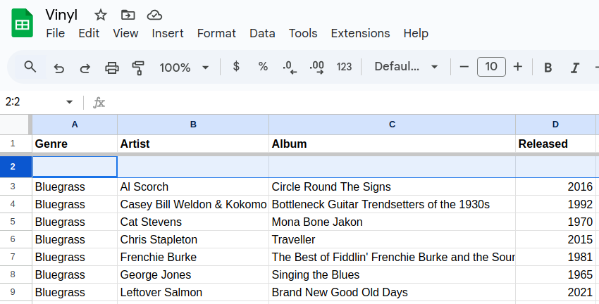
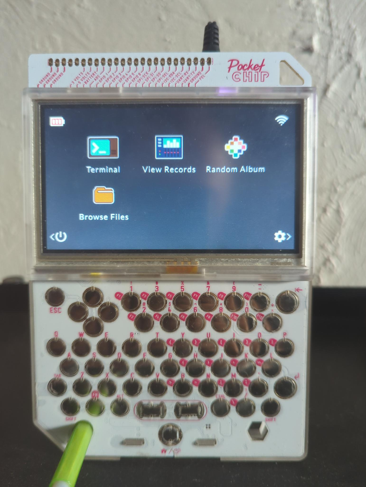
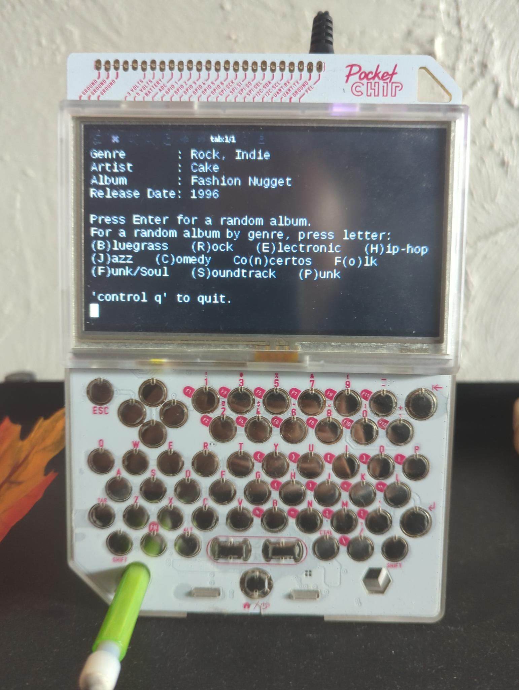

# PocketChip Random Album Picker

This repository details how to build a python app on a Pocket C.H.I.P. that ingests a CSV of vinyl records and displays them at random. The keyboard can be used to pick songs out of a certain genre.

## Requirements
- A [Pocket C.H.I.P.](https://shop.pocketchip.co/pages/about) I believe this company is now insolvent, but there may be devices floating around.
- A CSV file of records. Here is a snippet of how I have my fields arranged in Google Sheets, which was then exported to a CSV:
	

## Files
- /`usr/share/pocket-home/config.json` - contains shell commands, paths to icons, the python app, and the csv.
- `/home/chip/random_album.py`
- `/home/chip/vinyl.csv`

## End Result
Pocket C.H.I.P. app selection:

'Random Album' app running:

